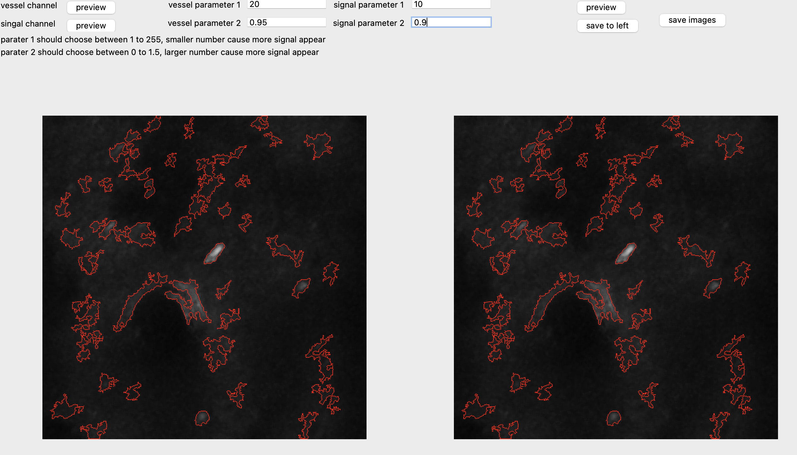

# Title

This is a work for cell analysis

## Install

Download the github repo and unzip to a directory for example (D:\doucments\cellproject) 

We need to install a suitable [conda](https://conda.io/) evnironment on Windows by following the steps on this [link](https://docs.anaconda.com/free/anaconda/install/windows/). And activate the environemnt with  

```
conda env create -n myenv pthon=3.9
conda activate myenv
```

Then go the the unzip directory by
```
cd /d D:\documents\cellproject
pip install -r requirments.txt
```

## Usage
Open anaconda prompt and go to the directory
```
conda activate myenv
cd /d D:\documents\cellproject
```
Open the program
```
python main.py
```

The image directory can be setting when open the file main.py, arg_para["file_path_1"] represents the path of vessel channel, arg_para["file_path_2"] represents the path of Ca signal channel.



For example above, the original images could be previewed by click the left two preview button. By clicking the preview button on the right side, a result could be seen on right bottom, it could be saved to the left bottom by clicking the "save to left" button. It can be comapred with other analyais results by changing the premeters and clicking the "preveiw" button on the right. The result can be saved in to folders by clicking the "save images" button. 


## Contributing


## License
